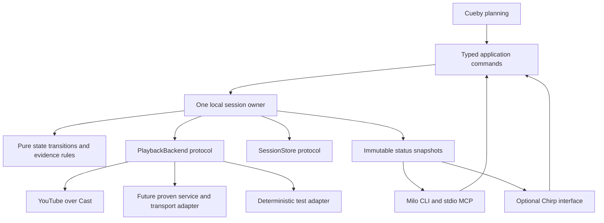

# TellyQ architecture direction

Updated after the M1 foundation merge, 2026-09-21. This remains a staged design.
Implemented boundaries and future interfaces are distinguished below; the diagram
shows the intended direction, including later milestones.

At `a2b72a9`, `tellyq/domain/` contains immutable values, backend/store/clock
protocols and pure evidence policy. `tellyq/state.py` validates version-1 queue and
legacy session JSON, and `tellyq/cast_messages.py` normalizes unknown Cast input
without importing PyChromecast. Typed wire records, Ruff/ty/pytest, the uv lock
and packaging/CI checks are also in place. The live controller has not yet adopted
all those contracts. M1's second-wave candidates add `PlaybackApplication`, a
Cast adapter, a revision-checked JSON snapshot store and versioned reports, plus
correlated receiver-idle evidence. The combined candidates passed 351 offline
tests and packaging/install checks; merge and live acceptance remain pending.
See the [acceptance record](M1-ACCEPTANCE.md).

Milo/MCP, Chirp, a persistent runner, SQLite and a `src/` layout are future work;
none is required to finish the current one-program core.

## Design decision

Keep the application policy independent of streaming services, control transports
and user interfaces. Implement capabilities honestly: the same physical receiver
may support very different controls and observations in different apps.

A provider identifies the content ecosystem; a transport controls a device.
The first adapter combines YouTube and Cast. Do not force every backend into a
provider × transport class hierarchy before a second implementation needs it.
Catalog search, title resolution and playback are separate concerns.

## Types and contracts

Use standard Python 3.14 types, `Protocol`, enums, and frozen/slotted dataclasses.
Frozen dataclasses are only shallowly immutable: shared collections must be tuples,
frozensets or owned read-only snapshots. Validate unknown external data once at
the boundary; use typed values within the application.

| Contract | Meaning / required information |
| --- | --- |
| `ContentRef` | Provider plus opaque content ID, kind and optional title. A series or search result is not an exact episode. |
| `PlaybackTarget` | Stable device identity and chosen adapter route. Names are presentation; network addresses remain local configuration. |
| `PlaybackCapabilities` | Per-route exact launch, stop, identity, progress, completion and display support, with verified/unsupported/unknown status and dated provenance. Pause/resume and power controls are future additions. |
| `PlaybackRequest` | Content, target, queue item, request ID and attempt ID. IDs correlate effects; they do not guarantee remote deduplication. |
| `PlaybackScope` | An explicitly owned session, connection generation and monotonic start boundary. A command receipt alone cannot establish it. |
| `CommandReceipt` | Accepted/rejected/unknown, timestamps and structured error, independent of observed playback. |
| `PlaybackObservation` | Target, content/session identity, fields, source, UTC time, sequence and connection-local monotonic time. Missing fields remain unknown. |
| `SessionSnapshot` | One scoped attempt, revision, receipt, latest observations, evidence, stop intent and ownership state. Multi-item queue execution is later work. |
| `DisplayEvidence` | Separate timestamped user confirmation or verified display signal. Historical confirmation never proves current TV power/input. |

The first three ports are defined in `tellyq/domain/ports.py`; production
application adapters are M1's remaining integration work:

- `PlaybackBackend`: describe capabilities, start an exact request, obtain
  observations and stop an owned session. Pause/seek use separate supported
  capabilities rather than success-shaped no-ops. Library-specific objects stay
  inside the adapter; YouTube content parsing is not a shared domain utility.
- `SessionStore`: load and atomically compare/save an attempt snapshot using
  revision checks. Wire schemas and process-restart recovery belong to the store
  adapter; persisted monotonic evidence must not become fresh after restart.
  A durable command-intent journal and multi-item recovery belong to M2.
- `Clock`: UTC timestamps for records and monotonic deadlines for live waits.
  Persisted monotonic values are not comparable across host restarts.
- `Catalog` / `ContentResolver`: add at M6 when there is a real catalog consumer;
  return known exact references plus availability evidence, not guessed watch URLs.

Typed application methods can be exposed through Milo without making Milo types
part of the domain. Generate input and output wire contracts from annotated command
types using the selected Milo version. Prove supported dataclass/TypedDict shapes
in the adoption spike; keep one central codec where conversion is required.
Do not hand-maintain separate CLI and MCP schemas.

## Three kinds of state

1. **Queue intent:** pending, current, completed, skipped, canceled or needs attention.
2. **Observed playback:** unknown, idle, buffering, playing, paused or ended, tied to
   a particular receiver session and content identity.
3. **Command execution:** pending, dispatched, acknowledged, rejected or uncertain.

An acknowledged start can coexist with unknown playback. A user stop cancels
advancement; it is not natural completion. An app disappearing may indicate stop,
failure or takeover. Missing metadata is not an empty queue or a finished episode.
Provider autoplay to a different title is not automatically TellyQ's next item.

Normalize raw adapter messages without inventing fields. A pure reducer then maps
`state + event -> next state + requested effects`. Clocks, sleeps, disk/network I/O
and generated IDs live outside the reducer. Completion policy consumes correlated,
fresh evidence; the runner executes effects and persists the resulting decisions.

Errors have stable codes, a useful message, an operation/attempt ID, an uncertainty
indicator and a suggested recovery step. Examples include `device_unavailable`,
`auth_required`, `unsupported_capability`, `session_replaced`, `observation_stale`
and `command_outcome_unknown`. Retryability is not permission to repeat a possibly
successful start. Inspect the receiver before retrying uncertain effects.

## Ownership, persistence and cancellation

The present process-wide lock protects short experiments, but a lock held over a
whole program would prevent useful stop/status commands. M2 introduces one local
session runner with a command mailbox and immutable read snapshots. Device effects
are serialized; callback threads enqueue observations. Each device client and its
request session have a clear owner. No framework request handler shares a mutable
PyChromecast controller directly.

Use one foreground `tellyq serve` process initially, with a private local IPC endpoint
for short-lived CLI/MCP clients. The IPC envelope reuses application command and
result types. Closing an MCP client does not kill an active TV program. Starting a
second owner fails clearly. Define shutdown, cancellation and operator stop before
adding automatic background startup. No recurring agent wakeups are needed.

Keep status reads responsive during network calls. Bound all I/O and observation
windows; do not hold persistence locks while waiting on the network. A stop request
cancels queued advancement immediately and is dispatched by the device owner as
soon as any bounded in-flight operation allows. Measure the delay under faults.

Keep JSON for M1's small single-writer state. At M2, prefer a local SQLite store
for atomic queue position, attempt and command-intent updates in one transaction.
Migrate existing JSON explicitly and retain readable JSON run reports. SQLite
transactions cannot atomically commit a remote TV command: reconcile the uncertain
gap after restart. Do not automatically resend it. Journal only useful decisions
and observations; a general event-sourcing platform is unnecessary.

All addresses, session credentials, pairing material and detailed histories stay
under ignored runtime state. Committed fixtures use synthetic identifiers and
sanitized messages. Public error output must not contain tokens or credential URLs.

## What to reuse from the existing Python stack

This review used the local Chirp checkout and its installed Milo 0.4.3 / Kida 0.12.0
code, plus the public Kida and Milo repository documentation and MCP router. No
changes were made to those projects and their full suites were not rerun.

| Project / evidence inspected | Adopt in TellyQ | Scope |
| --- | --- | --- |
| [Kida immutable tokens](https://github.com/lbliii/kida/blob/main/src/kida/_types.py) and [sharing contract](https://github.com/lbliii/kida/blob/main/site/content/docs/about/thread-safety.md) | Frozen value objects, explicit ownership, bounded sharing guarantees and actual GIL-disabled tests | Engineering patterns now; rendering through Milo/Chirp only when needed |
| [Milo protocols](https://github.com/lbliii/milo-cli/blob/main/src/milo/_protocols.py), [types](https://github.com/lbliii/milo-cli/blob/main/src/milo/_types.py), [MCP router](https://github.com/lbliii/milo-cli/blob/main/src/milo/_mcp_router.py) and [test layers](https://github.com/lbliii/milo-cli/blob/main/docs/testing.md) | Small structural protocols, pure state transitions, one typed command definition, schema/dispatch/transport parity | Recommend adopting Milo for CLI + local MCP in M3, after a pinned-version integration test |
| [Chirp typed command handlers](https://github.com/lbliii/chirp/blob/main/src/chirp/cli/_milo_handlers.py), [tool registry](https://github.com/lbliii/chirp/blob/main/src/chirp/tools/registry.py) and [state snapshots](https://github.com/lbliii/chirp/blob/main/src/chirp/app/state.py) | Setup-time registration, stable runtime views, separate framework adapters and executable contracts | Optional web extra in M7; playback never depends on an ASGI server |

Milo is an especially good fit because its MCP discovery/dispatch already uses the
registered command contracts and supports structured results. Its own tests are
not proof that TellyQ's hardware effects are correct: add application parity and
real-client tests. Chirp also exposes tools, but do not build two independent MCP
registries. A future hosted surface must project the same application commands.

Use focused local modules for clocks/deadlines, JSON serialization/migrations,
diagnostics and runtime paths. Extract a utility only after concrete callers share
its semantics. Avoid a generic `utils.py`, service locator, plugin marketplace or
new shared ecosystem package for this application.

## Python and quality gates

Keep Python 3.14 with the standard GIL build as the supported initial runtime.
Threading is valuable for I/O ownership and observation responsiveness regardless
of the GIL. Add a 3.14t lane that checks `sys._is_gil_enabled()` after imports and
runs concurrent command/event tests against actual dependency versions. Do not
force an unsupported extension to run without the GIL. Kida/Milo's support does
not establish PyChromecast, protobuf or zeroconf thread safety.

Borrow the stack's Ruff/Ty/pytest workflow, dependency pinning and explicit public
contracts. Use unit tests for pure policy, replay tests for receiver traces, adapter
contract tests, CLI/MCP parity tests and explicitly opted-in live hardware tests.
Test behavior across boundaries, not only mock call counts. Add tests that prove a
contract check fails when the contract is intentionally broken.

Stage the package as `domain/`, `application/`, `adapters/`, `interfaces/` and
`infrastructure/` under `src/tellyq/` as each responsibility appears. Dependencies
point inward. Domain/policy imports neither PyChromecast nor Milo nor Chirp; imports
of the core do not open sockets, discover devices or create runtime directories.
